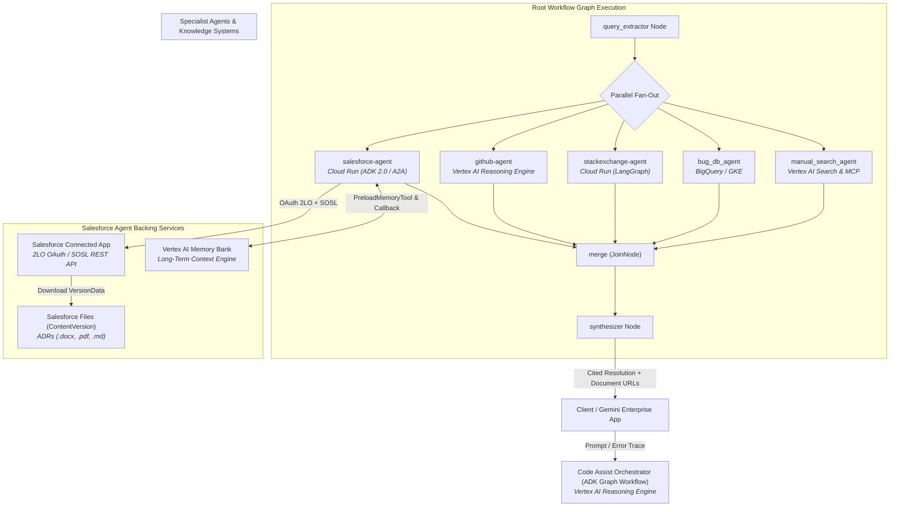

# Enterprise Production Runbook: Autonomous Multi-Agent Code Assistant & Salesforce Specialist Agent

**System:** Enterprise Code Assistant & Salesforce A2A Sub-Agent  
**Framework:** Google Agent Development Kit (ADK) 2.0 & A2A Protocol  
**Runtime Targets:** Cloud Run, Vertex AI Reasoning Engine (Agent Runtime), GKE  
**Environment:** Google Cloud Platform (`qwiklabs-gcp-04-71e46740a703`, Region: `us-central1`)  
**Status:** Production Operational Guide  
**Document Version:** 1.0.0  

---

## 1. System Architecture & Topology

### 1.1 Architecture Overview
The platform implements a distributed, federated multi-agent architecture orchestrated by a root **Code Assist** agent (`code-assistant`). When an engineer or client application submits a production error or architectural query, the root orchestrator extracts a normalized query, fans out simultaneously across five specialized agents over the **Agent-to-Agent (A2A) protocol**, merges the heterogeneous findings, and synthesizes a cited, actionable resolution.

The **Salesforce Agent** (`salesforce-agent`) functions as the institutional knowledge specialist. It queries architecture decision records (ADRs), post-mortems, and engineering policies stored as Salesforce Files using the Salesforce REST/SOSL API, hydrates conversations with long-term memory via Vertex AI Memory Bank, and exposes an A2A-compliant interface on Cloud Run.



---

### 1.2 System Components Matrix

| Component | Role / Purpose | Hosting Platform | Networking / Protocol | Key Dependencies |
| :--- | :--- | :--- | :--- | :--- |
| **`code-assistant`** | Root orchestrator running ADK Graph Workflow; extracts queries, dispatches to specialists, merges & synthesizes | Vertex AI Reasoning Engine (`us-central1`) | A2A JSON-RPC client, HTTPS | Vertex AI Gemini 3.5 Flash, Specialist Agent Cards |
| **`salesforce-agent`** | Specialist search agent for ADRs and engineering documents stored in Salesforce Files | Google Cloud Run (`us-central1`) | A2A JSON-RPC server (`/a2a/app`), HTTPS | Salesforce REST API v62.0, Vertex AI Memory Bank |
| **`github-agent`** | Codebase and issue search specialist | Vertex AI Reasoning Engine (`us-central1`) | A2A JSON-RPC (`/api/a2a/app`), IAM Authed | GitHub Copilot MCP, GitHub PAT |
| **`stackexchange-agent`** | Developer community Q&A specialist | Google Cloud Run (`us-central1`) | A2A Protocol (`/.well-known/agent-card.json`) | StackExchange API, Container Image in Artifact Registry |
| **`bug_db_agent`** | Internal incident and bug tracker specialist | BigQuery / A2A service | A2A JSON-RPC | BigQuery dataset, IAM credentials |
| **`manual_search_agent`** | Official engineering handbook & Google dev docs | In-process sub-agent in `code-assistant` | Direct API | Vertex AI Search (`code-manuals-datastore`), Developer Knowledge MCP |
| **Vertex AI Memory Bank** | Cross-session long-term memory for Salesforce agent | Vertex AI Agent Engine (`us-central1`) | gRPC / REST | GCS Staging Bucket (`gs://${PROJECT_ID}-staging`) |

---

## 2. Salesforce Agent Core Architecture & Mechanics

### 2.1 Two-Legged OAuth (2LO) Authentication
The Salesforce agent operates autonomously without user interaction using an app-only **2-legged OAuth 2.0 (Client Credentials Grant)**:
- **Token Endpoint:** `https://<SALESFORCE_DOMAIN>/services/oauth2/token`
- **Request Body:**
  ```http
  POST /services/oauth2/token HTTP/1.1
  Host: <SALESFORCE_DOMAIN>
  Content-Type: application/x-www-form-urlencoded

  grant_type=client_credentials&client_id=<CONSUMER_KEY>&client_secret=<CONSUMER_SECRET>
  ```
- **Session Caching:** Salesforce omits `expires_in` in client credentials responses. The agent caches the `access_token` and `instance_url` in the session state with a conservative TTL (3600 seconds minus 60-second safety skew). On any `401 Unauthorized` encountered during execution, the client automatically invalidates cache and triggers an on-demand re-authentication.

### 2.2 SOSL Full-Text Search & Multi-Format Excerpt Extraction
Salesforce stores uploaded documents inside the `ContentVersion` object and builds a full-text search index across `.docx`, `.pdf`, `.pptx`, `.txt`, and `.md` files.
1. **Query Construction:** Search queries are sanitized to escape reserved SOSL characters:
   ```text
   FIND {<escaped_query>} IN ALL FIELDS RETURNING ContentVersion(Id, Title, FileExtension, ContentDocumentId WHERE IsLatest = true LIMIT 25)
   ```
2. **Hit Enrichment & Excerpt Extraction:** SOSL only returns metadata, not text snippets. The agent downloads the raw binary bytes (`VersionData`) for the top 5 matching records:
   - `.docx` parsed with `python-docx`
   - `.pdf` parsed with `pypdf`
   - `.txt` / `.md` decoded as UTF-8
3. **Centered Windowing:** The agent locates the first occurrence of the search terms and generates a ~1500-character excerpt window centered on the match, returning document metadata, Lightning viewer URL (`/lightning/r/ContentDocument/<Id>/view`), and textual excerpts directly to Gemini.

### 2.3 Long-Term Memory (Vertex AI Memory Bank)
The agent integrates Vertex AI Reasoning Engine Memory Bank:
- **Hydration:** Initialized with `PreloadMemoryTool()`, reading pertinent past sessions and user context before query execution.
- **Persistence:** Uses `after_agent_callback=generate_memories_callback` to invoke `callback_context.add_session_to_memory()`, saving conversation context to `VertexAiMemoryBankService`.

---

## 3. Environment Variables & Configuration Reference

### 3.1 Salesforce Agent (`~/agents/salesforce-agent/.env`)

```ini
# Google Cloud Platform
GOOGLE_CLOUD_PROJECT=qwiklabs-gcp-04-71e46740a703
GOOGLE_CLOUD_LOCATION=global
GOOGLE_GENAI_USE_VERTEXAI=True
MODEL=gemini-3.5-flash

# Salesforce Connected App 2LO Credentials
SALESFORCE_DOMAIN=orgfarm-2e0db46538-dev-ed.develop.my.salesforce.com
SALESFORCE_CLIENT_ID=<Connected_App_Consumer_Key>
SALESFORCE_CLIENT_SECRET=<Connected_App_Consumer_Secret>
SALESFORCE_API_VERSION=v62.0
SALESFORCE_TOKEN_TTL_SECONDS=3600

# Long-Term Memory Configuration
MEMORY_BANK_ID=4627800735721979904
MEMORY_BANK_LOCATION=us-central1
```

### 3.2 Root Code Assistant (`~/agents/code-assistant/.env`)

```ini
GOOGLE_CLOUD_PROJECT=qwiklabs-gcp-04-71e46740a703
GOOGLE_CLOUD_LOCATION=global
GOOGLE_GENAI_USE_VERTEXAI=True
MODEL=gemini-3.5-flash
DATASTORE_ID=code-manuals-datastore
DEVELOPER_KNOWLEDGE_MCP_URL=https://developerknowledge.googleapis.com/mcp
SKILL_REGISTRY_LOCATION=us-central1
GITHUB_AGENT_URL=https://us-central1-aiplatform.googleapis.com/reasoningEngines/v1/projects/913613082989/locations/us-central1/reasoningEngines/3180737880452497408/api/a2a/app/.well-known/agent-card.json
STACKEXCHANGE_AGENT_URL=https://stackexchange-agent-xv7avvm2lq-uc.a.run.app/.well-known/agent-card.json
SALESFORCE_AGENT_URL=https://salesforce-agent-xv7avvm2lq-uc.a.run.app/a2a/app/.well-known/agent-card.json
BQ_AGENT_URL=https://bq-agent-xv7avvm2lq-uc.a.run.app/a2a/app/.well-known/agent-card.json
```

---

## 4. End-to-End Deployment & Setup Runbook

### Phase 1: Environment Initialization & Datastore Creation

```bash
# Set primary environment variables
export PROJECT_ID=qwiklabs-gcp-04-71e46740a703
export REGION=us-central1
gcloud config set project ${PROJECT_ID}
export PROJECT_NUMBER=$(gcloud projects describe ${PROJECT_ID} --format='value(projectNumber)')

# Create Discovery Engine Datastore for Code Manuals
curl -X POST \
  -H "Authorization: Bearer $(gcloud auth print-access-token)" \
  -H "Content-Type: application/json" \
  -H "X-Goog-User-Project: ${PROJECT_ID}" \
  "https://discoveryengine.googleapis.com/v1/projects/${PROJECT_ID}/locations/global/collections/default_collection/dataStores?dataStoreId=code-manuals-datastore" \
  -d '{"displayName":"Code manuals","industryVertical":"GENERIC","solutionTypes":["SOLUTION_TYPE_SEARCH"],"contentConfig":"CONTENT_REQUIRED"}'

# Import documentation corpus from GCS
curl -X POST \
  -H "Authorization: Bearer $(gcloud auth print-access-token)" \
  -H "Content-Type: application/json" \
  "https://discoveryengine.googleapis.com/v1/projects/${PROJECT_ID}/locations/global/collections/default_collection/dataStores/code-manuals-datastore/branches/0/documents:import" \
  -d '{"reconciliationMode":"INCREMENTAL","gcsSource":{"inputUris":["gs://'${PROJECT_ID}'-bucket/code_manuals/*"],"dataSchema":"content"}}'
```

---

### Phase 2: Deploying Specialist Agents

#### 1. GitHub Agent (Vertex AI Reasoning Engine)
```bash
cd ~/agents/github-agent
agents-cli deploy --project ${PROJECT_ID} --no-confirm-project --no-wait \
  --update-env-vars "$(grep -v '^#' .env | grep -v '^$' | grep -v '^GOOGLE_CLOUD_PROJECT' | paste -sd,)"

# Record Agent Card URL
export GITHUB_AGENT_URL=$(agents-cli deploy --status | grep -o 'https://[^ ]*agent-card.json')
echo "export GITHUB_AGENT_URL='${GITHUB_AGENT_URL}'" >> ~/.bashrc
```

#### 2. StackExchange Agent (Cloud Run)
```bash
cd ~/agents/stackexchange-agent
gcloud builds submit --tag ${REGION}-docker.pkg.dev/${PROJECT_ID}/agents/stackexchange-agent:latest
gcloud run deploy stackexchange-agent \
  --image ${REGION}-docker.pkg.dev/${PROJECT_ID}/agents/stackexchange-agent:latest \
  --region ${REGION} --allow-unauthenticated --port 8080

export SE_URL=$(gcloud run services describe stackexchange-agent --region ${REGION} --format='value(status.url)')
gcloud run services update stackexchange-agent --region ${REGION} --set-env-vars PUBLIC_URL=${SE_URL}
export STACKEXCHANGE_AGENT_URL="${SE_URL}/.well-known/agent-card.json"
echo "export STACKEXCHANGE_AGENT_URL='${STACKEXCHANGE_AGENT_URL}'" >> ~/.bashrc
```

#### 3. Salesforce Agent (Cloud Run)
```bash
cd ~/agents/salesforce-agent

# Deploy agent to Cloud Run
agents-cli deploy --project ${PROJECT_ID} --region ${REGION} --no-confirm-project \
  --update-env-vars "$(grep -v '^#' .env | grep -v '^$' | grep -v '^GOOGLE_CLOUD_PROJECT' | paste -sd,)"

# Allow public invocation for A2A communication
gcloud run services add-iam-policy-binding salesforce-agent \
  --region=${REGION} --member=allUsers --role=roles/run.invoker

# Export URLs
export SF_URL=$(gcloud run services describe salesforce-agent --region ${REGION} --format='value(status.url)')
export SALESFORCE_AGENT_URL="${SF_URL}/a2a/app/.well-known/agent-card.json"
echo "export SALESFORCE_AGENT_URL='${SALESFORCE_AGENT_URL}'" >> ~/.bashrc
```

---

### Phase 3: Vertex AI Memory Bank Setup

```bash
cd ~/agents/salesforce-agent

# 1. Ensure staging bucket exists for Reasoning Engine artifacts
gsutil mb -l us-central1 gs://${PROJECT_ID}-staging || true

# 2. Provision Memory Bank Reasoning Engine
GOOGLE_CLOUD_PROJECT=${PROJECT_ID} MEMORY_BANK_LOCATION=us-central1 uv run python scripts/create_memory_bank.py

# 3. Update Cloud Run service with MEMORY_BANK_ID
export MEMORY_BANK_ID="4627800735721979904"
gcloud run services update salesforce-agent --region ${REGION} \
  --set-env-vars MEMORY_BANK_ID=${MEMORY_BANK_ID},MEMORY_BANK_LOCATION=us-central1
```

---

### Phase 4: IAM & Service Account Cross-Service Permissions

The root agent running on Agent Runtime uses the default AI Platform Reasoning Engine service account (`service-${PROJECT_NUMBER}@gcp-sa-aiplatform-re.iam.gserviceaccount.com`). It requires permissions to invoke remote engines and query Discovery Engine:

```bash
# 1. Grant permission to call Reasoning Engine specialists (github-agent)
gcloud projects add-iam-policy-binding ${PROJECT_ID} \
  --member="serviceAccount:service-${PROJECT_NUMBER}@gcp-sa-aiplatform-re.iam.gserviceaccount.com" \
  --role="roles/aiplatform.user"

# 2. Grant permission to search code manuals in Discovery Engine
gcloud projects add-iam-policy-binding ${PROJECT_ID} \
  --member="serviceAccount:service-${PROJECT_NUMBER}@gcp-sa-aiplatform-re.iam.gserviceaccount.com" \
  --role="roles/discoveryengine.viewer"

# 3. Grant permission to invoke Cloud Run services (salesforce-agent, stackexchange-agent)
gcloud projects add-iam-policy-binding ${PROJECT_ID} \
  --member="serviceAccount:service-${PROJECT_NUMBER}@gcp-sa-aiplatform-re.iam.gserviceaccount.com" \
  --role="roles/run.invoker"
```

---

### Phase 5: Publishing GCP Skills & Deploying Root Code Assistant

```bash
cd ~/agents/code-assistant

# 1. Publish developer knowledge skill to GCP Skill Registry
uv run python scripts/publish_skill.py --project ${PROJECT_ID} --location ${REGION}

# 2. Verify all specialist URLs in .env are populated
blank=$(grep -E '^(GITHUB_AGENT_URL|STACKEXCHANGE_AGENT_URL|BQ_AGENT_URL|SALESFORCE_AGENT_URL)=$' .env)
if [ -n "${blank}" ]; then
  echo "ERROR: The following specialist URLs are blank:"
  echo "${blank}"
  exit 1
fi

# 3. Deploy Root Orchestrator to Vertex AI Agent Runtime
rm -rf .venv
agents-cli deploy --project ${PROJECT_ID} --no-confirm-project --no-wait \
  --update-env-vars "$(grep -v '^#' .env | grep -v '^$' | grep -v '^GOOGLE_CLOUD_PROJECT' | paste -sd,)"

# 4. Register with Gemini Enterprise
agents-cli publish gemini-enterprise \
  --gemini-enterprise-app-id "projects/${PROJECT_NUMBER}/locations/global/collections/default_collection/engines/enterprise-app" \
  --display-name "Code Assist" \
  --description "Researches a production error across a bug database, the engineering handbook, Salesforce, GitHub, and Stack Exchange, and returns one cited fix."
```

---

## 5. Day-2 Operational Procedures

### 5.1 Routine Health & Readiness Verification

#### Check Salesforce Agent A2A Card
```bash
curl -sS "${SALESFORCE_AGENT_URL}" | python3 -m json.tool
```
*Expected Result:* JSON payload with `"name": "salesforce_agent"`, `"protocol_version": "0.3.0"`, and skills `search_salesforce` and `preload_memory`.

#### Test Single-Turn ADR Search
```bash
agents-cli run --url "${SF_URL}" --mode a2a "ADR-007"
```
*Expected Result:* Returns finding citing `ADR-007: mTLS Between Internal Services.docx` with ContentDocument Lightning URL and summary excerpt.

#### Test Root Agent Integration
```bash
agents-cli run "NullPointerException in payment processing service when certificate expires"
```
*Expected Result:* All five specialists invoked; synthesis combines GitHub commits, StackExchange threads, and Salesforce ADR-007 recommendations.

---

### 5.2 Populating & Refreshing Salesforce Documents
When engineering teams release new ADRs or policies:
1. Open Salesforce: `https://<SALESFORCE_DOMAIN>`
2. Navigate to **App Launcher > Files > Upload Files**.
3. Upload `.docx`, `.pdf`, or `.md` files (e.g. `ADR-008_zero_trust_network.docx`).
4. Ensure files are shared with the **Run-As user** configured in the Connected App, or grant **Query All Files** on that user's profile.
5. **Index Lag Warning:** SOSL takes between **10 to 15 minutes** to index document bodies. To check if the file was received immediately, execute a SOQL count check:
   ```bash
   # SOQL check (immediate verification of ContentVersion upload)
   curl -s -H "Authorization: Bearer ${ACCESS_TOKEN}" \
     "https://${SALESFORCE_DOMAIN}/services/data/v62.0/query?q=SELECT+Id,Title,FileExtension+FROM+ContentVersion+WHERE+IsLatest=true"
   ```

---

### 5.3 Memory Bank Operations & Lifecycle Management
Vertex AI Memory Bank maintains memories for persistent user context across sessions.

#### Inspecting Existing Memory Engines
```bash
python3 -c "
import vertexai
from vertexai.preview import reasoning_engines
vertexai.init(project='${PROJECT_ID}', location='us-central1')
for engine in reasoning_engines.ReasoningEngine.list():
    print(engine.resource_name, getattr(engine, 'display_name', ''))
"
```

#### Purging / Rotating Memory Bank
To recreate the memory bank from scratch:
```bash
# Delete existing engine via gcloud
gcloud ai reasoning-engines delete ${MEMORY_BANK_ID} --project=${PROJECT_ID} --location=us-central1 --quiet

# Re-run creation script
cd ~/agents/salesforce-agent
GOOGLE_CLOUD_PROJECT=${PROJECT_ID} MEMORY_BANK_LOCATION=us-central1 uv run python scripts/create_memory_bank.py
```

---

## 6. Incident Response & Troubleshooting Playbooks

### Incident Playbook Matrix

| ID | Symptom | Severity | Probable Root Cause | Resolution Action |
| :--- | :--- | :--- | :--- | :--- |
| **INC-01** | `403 Forbidden` on calling `github-agent` from root | P1 - High | Missing `roles/aiplatform.user` on Reasoning Engine service SA | Grant IAM role to `service-${PROJECT_NUMBER}@gcp-sa-aiplatform-re.iam.gserviceaccount.com` |
| **INC-02** | `Salesforce auth failed: 401 Unauthorized` | P1 - High | Invalid Client Secret or Run-As user disabled | Check `.env` secrets; verify Connected App client credentials |
| **INC-03** | SOSL returns `data: []` for recently uploaded ADR | P2 - Medium | SOSL search indexing lag or lack of `Query All Files` | Wait 15 mins for indexing; verify Run-As user file permissions |
| **INC-04** | Cloud Run returns `403 Forbidden` on `/a2a/app` | P1 - High | Missing `allUsers` invoker permission or missing ID token | Run `gcloud run services add-iam-policy-binding --member=allUsers --role=roles/run.invoker` |
| **INC-05** | `create_memory_bank.py` fails with Staging Bucket Error | P2 - Medium | Staging bucket `gs://${PROJECT_ID}-staging` missing | Run `gsutil mb -l us-central1 gs://${PROJECT_ID}-staging` |
| **INC-06** | Root Agent fails with `KeyError: 'SALESFORCE_AGENT_URL'` | P1 - High | Missing environment variable in `code-assistant/.env` | Export variables and recreate `.env` from bash session |
| **INC-07** | `agents-cli deploy` stuck with `pending_operation` | P2 - Medium | Previous deployment crashed holding operation lock | Remove `.venv` and delete lock from `deployment_metadata.json` |

---

### Detailed Incident Resolution Procedures

#### INC-01: Root Agent Gets 403 Calling Specialist Agents
- **Symptom:** In Cloud Logging for `code-assistant`: `httpx.HTTPStatusError: Server error '403 Forbidden' for url: .../agent-card.json`.
- **Root Cause:** Vertex AI Agent Runtime invokes sub-agents using the Google Cloud system identity for Reasoning Engines. That service account lacks IAM permissions to query reasoning engines.
- **Fix:**
  ```bash
  export PROJECT_NUMBER=$(gcloud projects describe ${PROJECT_ID} --format='value(projectNumber)')
  gcloud projects add-iam-policy-binding ${PROJECT_ID} \
    --member="serviceAccount:service-${PROJECT_NUMBER}@gcp-sa-aiplatform-re.iam.gserviceaccount.com" \
    --role="roles/aiplatform.user"
  ```

#### INC-02: Salesforce Authentication Failure (401 / Invalid Credentials)
- **Symptom:** Agent logs: `Salesforce auth failed: 400 Bad Request: {"error":"invalid_client_id"}` or `401 Unauthorized`.
- **Root Cause:** Mismatched `SALESFORCE_CLIENT_ID` or `SALESFORCE_CLIENT_SECRET`, or the Connected App has not had its OAuth policy set to **"All users may self-authorize"** with a valid **Run-As User**.
- **Fix:**
  1. Open Salesforce Setup > App Manager > Your Connected App.
  2. Click **Manage** > **Edit Policies**.
  3. Set **Permitted Users** to `Admin approved users are pre-authorized` OR verify that the **Run-As User** has an active System Administrator profile.
  4. In `salesforce-agent/.env`, update `SALESFORCE_CLIENT_SECRET` without whitespace.
  5. Redeploy:
     ```bash
     agents-cli deploy --project ${PROJECT_ID} --region ${REGION} --no-confirm-project \
       --update-env-vars "$(grep -v '^#' .env | grep -v '^$' | grep -v '^GOOGLE_CLOUD_PROJECT' | paste -sd,)"
     ```

#### INC-03: Document Exists in Files but SOSL Returns Zero Results
- **Symptom:** Querying for known ADR returns `If the tool returns no results, say so plainly`.
- **Root Cause:**
  1. Salesforce document indexing has an SLA of ~15 minutes after upload.
  2. The Connected App's Run-As user lacks file read permissions.
- **Fix:**
  1. Check upload timestamp in Salesforce Files. If < 15 minutes, allow indexing to complete.
  2. In Salesforce Setup, navigate to **Profiles > [Run-As User's Profile] > System Permissions**.
  3. Ensure both **"Query All Files"** and **"View All Data"** are checked.
  4. Test raw search with cURL:
     ```bash
     curl -s -H "Authorization: Bearer ${ACCESS_TOKEN}" \
       "https://${SALESFORCE_DOMAIN}/services/data/v62.0/search?q=FIND+%7BADR%7D+IN+ALL+FIELDS"
     ```

#### INC-04: Deployment Lockout (`pending_operation`)
- **Symptom:** `agents-cli deploy` exits with `Operation in progress by owner ...`
- **Fix:**
  ```bash
  cd ~/agents/code-assistant
  rm -f deployment_metadata.json.lock
  # Clear state or update deployment_metadata.json to clear pending_operation block
  python3 -c "
  import json
  with open('deployment_metadata.json', 'r') as f:
      d = json.load(f)
  d.pop('pending_operation', None)
  with open('deployment_metadata.json', 'w') as f:
      json.dump(d, f, indent=2)
  "
  ```

---

## 7. Security, Compliance & Disaster Recovery

### 7.1 Secret Management Best Practices
1. **Never Commit Secrets:** Ensure `.env` is listed in `.gitignore`. Provide only `.env.example` with sanitized placeholders.
2. **Secret Manager Migration:** In production environments, replace environment variables with Google Cloud Secret Manager references:
   ```bash
   gcloud secrets create salesforce-client-secret --replication-policy="automatic"
   echo -n "YOUR_SECRET" | gcloud secrets versions add salesforce-client-secret --data-file=-
   ```
   Reference inside Cloud Run deployment:
   ```bash
   gcloud run services update salesforce-agent \
     --set-secrets="SALESFORCE_CLIENT_SECRET=salesforce-client-secret:latest"
   ```

### 7.2 Service Account Least Privilege Principle
Ensure the runtime identities adhere strictly to minimal viable scopes:
- Cloud Run service identity only needs access to Vertex AI (`roles/aiplatform.user`) and Cloud Logging (`roles/logging.logWriter`).
- Root Reasoning Engine service account requires `roles/aiplatform.user`, `roles/discoveryengine.viewer`, and `roles/run.invoker`.

### 7.3 Disaster Recovery (DR) & Rollback Procedures
- **Cloud Run Rollback:** If a deployment introduces a breaking change, instantly divert traffic to the previous healthy revision:
  ```bash
  gcloud run services rollback salesforce-agent --region=${REGION}
  ```
- **Reasoning Engine Rollback:** Deployments create immutable versions under `/reasoningEngines/<id>`. To revert the root agent, update the `agent_card.json` reference in `code-assistant/.env` or re-point the Gemini Enterprise application to the prior engine ID.

---

## 8. Verification & Smoke Test Checklist

Execute this automated smoke test suite to validate the entire platform:

```bash
#!/usr/bin/env bash
set -eo pipefail

echo "=========================================="
echo "    PLATFORM SMOKE TEST EXECUTION         "
echo "=========================================="

echo "[1/4] Checking Salesforce Agent Cloud Run endpoint..."
SF_URL=$(gcloud run services describe salesforce-agent --region us-central1 --format='value(status.url)')
HTTP_STATUS=$(curl -s -o /dev/null -w "%{http_code}" "${SF_URL}/a2a/app/.well-known/agent-card.json")
if [ "${HTTP_STATUS}" -eq 200 ]; then
  echo "  ✓ Salesforce Agent Card accessible (HTTP 200)"
else
  echo "  ✗ Salesforce Agent Card failed with HTTP ${HTTP_STATUS}"
  exit 1
fi

echo "[2/4] Testing direct SOSL ADR-007 retrieval via A2A..."
OUTPUT=$(agents-cli run --url "${SF_URL}" --mode a2a "ADR-007" 2>&1)
if echo "${OUTPUT}" | grep -q "ADR-007"; then
  echo "  ✓ Successfully retrieved ADR-007 findings from Salesforce"
else
  echo "  ✗ Salesforce ADR search failed"
  echo "${OUTPUT}"
  exit 1
fi

echo "[3/4] Verifying Memory Bank engine..."
uv run python -c "
import vertexai
from vertexai.preview import reasoning_engines
vertexai.init(project='${GOOGLE_CLOUD_PROJECT}', location='us-central1')
engines = [e.display_name for e in reasoning_engines.ReasoningEngine.list()]
assert 'salesforce-agent-memory' in engines, 'Memory bank not found!'
print('  ✓ Vertex AI Memory Bank verified')
"

echo "[4/4] Verifying Gemini Enterprise App Registration..."
export PROJECT_NUMBER=$(gcloud projects describe ${GOOGLE_CLOUD_PROJECT} --format='value(projectNumber)')
curl -s -H "Authorization: Bearer $(gcloud auth print-access-token)" \
  "https://discoveryengine.googleapis.com/v1/projects/${PROJECT_NUMBER}/locations/global/collections/default_collection/engines/enterprise-app" \
  | grep -q "enterprise-app" && echo "  ✓ Gemini Enterprise Engine operational"

echo "=========================================="
echo "    ALL SYSTEM CHECKS PASSED              "
echo "=========================================="
```
